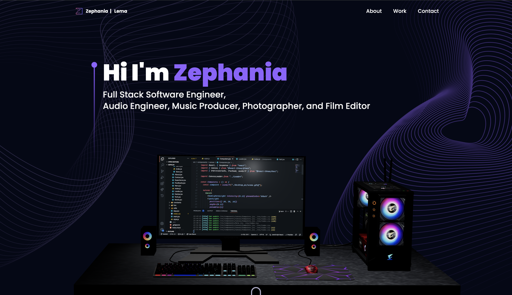
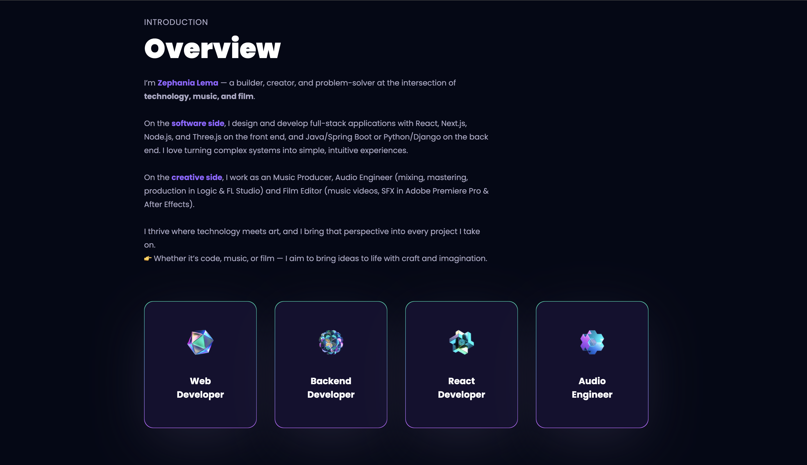
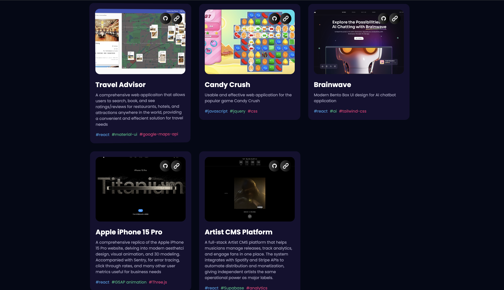

# Portfolio Website 🌐

An interactive web application that showcases my resume, skills, and selected projects.  
This site serves as a central hub for my work and is designed to reflect both my technical abilities and eye for design.  

🔗 **Live Site:** [Portfolio](https://zephania-lema-portfolio.netlify.app/)  

---

## ✨ Features
- **Interactive UI/UX:** Smooth, modern design with responsive layouts.  
- **3D Elements:** Integrated **Three.js** for dynamic visuals and interactivity.  
- **Project Showcase:** Highlights selected technical and creative projects.  
- **Contact Integration:** Built-in email form powered by **EmailJS**.  
- **Responsive Design:** Optimized for desktop, tablet, and mobile.  

---

## 🛠️ Tech Stack
- **Frontend:** React, Tailwind CSS  
- **3D Graphics:** Three.js  
- **Utilities:** EmailJS  

---

## 📸 Screenshots

| HomePage | Introduction | Projects |
|----------|--------------|----------|
|  |  |  | 

---

## 🚀 Getting Started
Clone the repository and install dependencies:

```bash
git clone https://github.com/your-username/portfolio.git
cd portfolio
npm install
npm run dev
